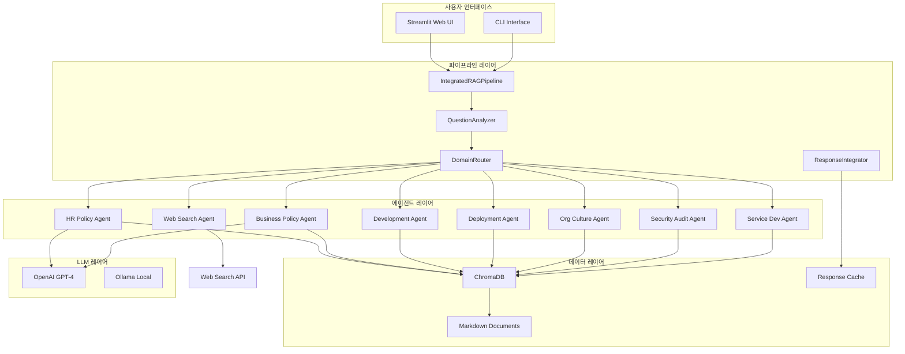
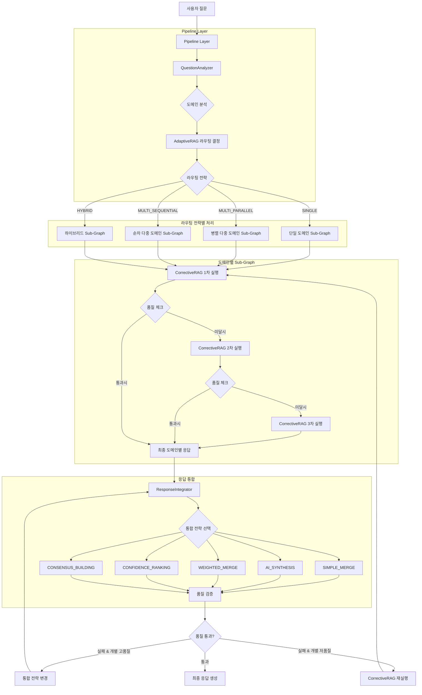
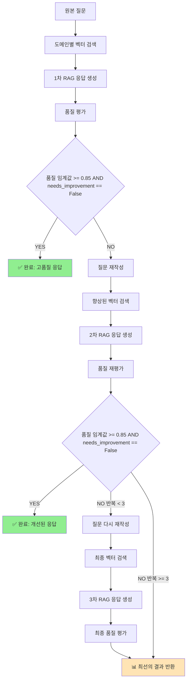
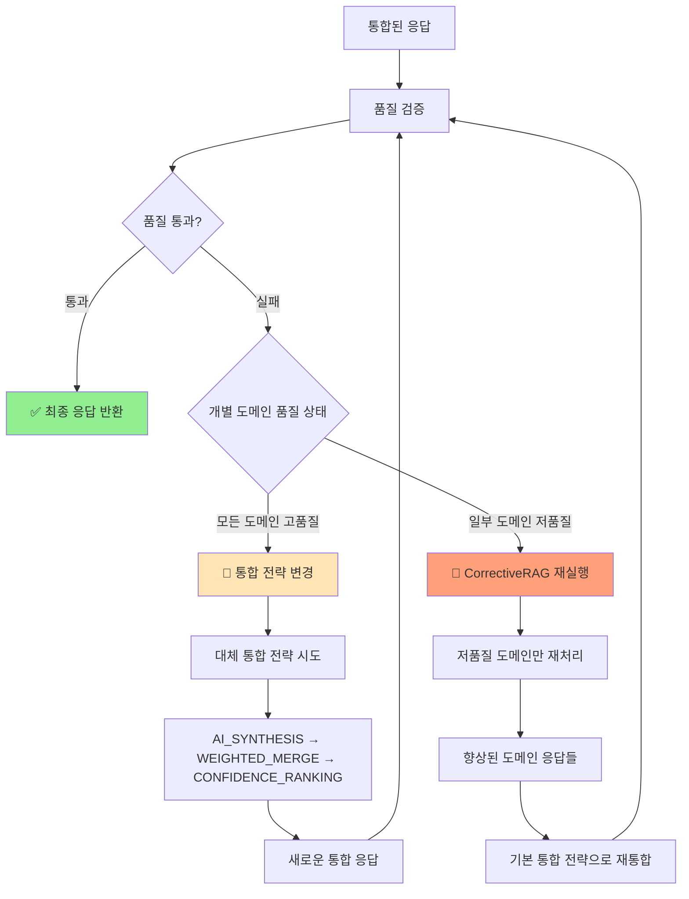

# 🏗️ CoolStay Multi-Agent RAG 시스템 아키텍처

## 📋 목차
1. [개요](#개요)
2. [시스템 아키텍처](#시스템-아키텍처)
3. [핵심 컴포넌트](#핵심-컴포넌트)
4. [처리 파이프라인](#처리-파이프라인)
5. [의사결정 프로세스](#의사결정-프로세스)
6. [기술 스택](#기술-스택)
7. [확장성 및 최적화](#확장성-및-최적화)

---

## 개요

CoolStay Multi-Agent RAG 시스템은 **7개의 도메인 특화 에이전트**를 활용하여 조직 내부 지식을 효과적으로 검색하고 응답을 생성하는 고급 RAG(Retrieval-Augmented Generation) 시스템입니다.

### 주요 특징
- ✅ **다중 에이전트 아키텍처**: 도메인별 전문 에이전트 활용
- ✅ **지능형 라우팅**: 질문 분석 기반 최적 에이전트 선택
- ✅ **Corrective RAG**: 반복적 품질 개선 메커니즘
- ✅ **실시간 웹 검색**: 최신 정보 통합 지원
- ✅ **확장 가능한 설계**: 새로운 도메인 및 에이전트 쉽게 추가

---

## 시스템 아키텍처



---

## 핵심 컴포넌트

### 1. **IntegratedRAGPipeline** (`src/pipeline/rag_pipeline.py`)
파이프라인 전체를 조율하는 오케스트레이터 역할
- 비동기 처리 관리
- 단계별 실행 조정
- 에러 핸들링 및 복구

### 2. **QuestionAnalyzer** (`src/routing/question_analyzer.py`)
사용자 질문을 분석하여 라우팅 정보 생성
- **질문 타입 분류**: `SPECIFIC_DOMAIN`, `CROSS_DOMAIN`, `GENERAL`, `COMPLEX`
- **도메인 매핑**: 7개 도메인 중 관련 도메인 식별
- **복잡도 평가**: `simple`, `moderate`, `complex`
- **웹 검색 필요성 판단**

### 3. **DomainRouter** (`src/routing/domain_router.py`)
분석 결과를 기반으로 적절한 에이전트 선택 및 실행
- **라우팅 전략**: `SINGLE`, `MULTI_PARALLEL`, `MULTI_SEQUENTIAL`, `HYBRID`
- **동시 실행 관리**: 최대 3개 에이전트 병렬 처리
- **우선순위 기반 선택**

### 4. **Domain Agents** (`src/agents/`)
각 도메인별 전문 지식을 처리하는 7개 특화 에이전트
- **HR Policy Agent**: 인사 정책 및 복무 규정
- **Business Policy Agent**: 비즈니스 정책 및 프로세스
- **Development Agent**: 개발 가이드라인 및 표준
- **Deployment Agent**: 배포 및 CI/CD 프로세스
- **Org Culture Agent**: 조직 문화 및 가치관
- **Security Audit Agent**: 보안 감사 및 컴플라이언스
- **Service Dev Management Agent**: 서비스 개발 관리 지침

### 5. **CorrectiveRAGAgent** (`src/agents/corrective_agent.py`)
응답 품질을 반복적으로 개선
- **품질 평가**: 0.0 ~ 1.0 스코어링
- **반복 개선**: 최대 3회 반복
- **자동 보강**: 부족한 부분 자동 보완

### 6. **ResponseIntegrator** (`src/routing/response_integrator.py`)
다중 에이전트 응답을 통합하여 최종 답변 생성
- **통합 전략**: `SIMPLE_MERGE`, `AI_SYNTHESIS`, `WEIGHTED_MERGE`, `CONFIDENCE_RANKING`, `CONSENSUS_BUILDING`
- **품질 메트릭스**: 완전성, 명확성, 관련성, 정확성 평가
- **스마트 전략 선택**: 개별 도메인 품질에 따른 적응적 통합

### 7. **ChromaManager** (`src/vectorstore/chroma_manager.py`)
벡터 데이터베이스 관리 및 검색
- **임베딩 생성**: OpenAI Embeddings 사용
- **유사도 검색**: 코사인 유사도 기반
- **메타데이터 필터링**: 도메인별 문서 필터링

---

## 처리 파이프라인

### 📊 수정된 단계별 처리 흐름



### 🔄 **핵심 아키텍처 개념**

#### 1. **Pipeline Layer (파이프라인 레이어)**
- **역할**: 전체 처리 흐름을 조율하는 최상위 계층
- **구성**: QuestionAnalyzer → AdaptiveRAG → DomainRouter
- **특징**: 질문 분석 후 적절한 라우팅 전략 결정

#### 2. **AdaptiveRAG 라우팅 시스템**
- **SINGLE**: 단일 도메인 처리 (단순 질문)
- **MULTI_PARALLEL**: 병렬 다중 도메인 처리 (교차 도메인 질문)
- **MULTI_SEQUENTIAL**: 순차 다중 도메인 처리 (복잡한 교차 도메인)
- **HYBRID**: 웹 검색 + 도메인 처리 혼합

#### 3. **도메인별 Sub-Graph 처리**
각 선택된 도메인마다 독립적인 서브그래프에서 처리:
```python
Sub-Graph 내부 처리 흐름:
1. 도메인 문서 벡터 검색 (ChromaDB)
2. CorrectiveRAG 1차 실행 (최대 3회 반복)
   - 품질 점수 계산 (0.0 ~ 1.0)
   - 임계값(0.85) 미만 시 query 재작성
   - needs_improvement 플래그 체크
3. 최종 도메인별 응답 생성
```

#### 4. **ResponseIntegrator 통합 시스템**
5가지 통합 전략을 통해 다중 응답 병합:
- **SIMPLE_MERGE**: 단순 텍스트 연결
- **AI_SYNTHESIS**: AI 기반 지능적 종합 (기본값)
- **WEIGHTED_MERGE**: 신뢰도 기반 가중 병합
- **CONFIDENCE_RANKING**: 신뢰도 순위 기반 선택
- **CONSENSUS_BUILDING**: 공통 요소 기반 합의

#### 5. **스마트 품질 검증 및 개선 시스템**
```python
품질 검증 후 개선 전략:
1. 개별 도메인 모두 고품질 → 통합 전략 변경 시도
2. 개별 도메인 일부 저품질 → CorrectiveRAG 재실행
3. 최대 3회 시도 후 최선의 결과 반환
```

---

## 의사결정 프로세스

### 🎯 라우팅 전략 결정 로직

```python
def determine_routing_strategy(analysis: QuestionAnalysis) -> RoutingStrategy:
    """
    질문 분석 결과를 기반으로 최적의 라우팅 전략 결정
    """
    # 1. 단순 단일 도메인 질문
    if len(analysis.primary_domains) == 1 and analysis.complexity == "simple":
        return RoutingStrategy.SINGLE

    # 2. 복잡한 교차 도메인 질문
    elif analysis.question_type == QuestionType.CROSS_DOMAIN:
        if analysis.complexity == "complex":
            return RoutingStrategy.MULTI_SEQUENTIAL  # 순차적 처리
        else:
            return RoutingStrategy.MULTI_PARALLEL     # 병렬 처리

    # 3. 웹 검색이 필요한 경우
    elif analysis.requires_web_search:
        return RoutingStrategy.HYBRID

    # 4. 기본값
    else:
        return RoutingStrategy.SINGLE
```

### 🔄 Corrective RAG 품질 개선 프로세스



#### **핵심 품질 개선 메커니즘**

1. **이중 조건 검증**:
   ```python
   # 두 조건을 모두 만족해야 완료
   quality_score >= 0.85 AND needs_improvement == False
   ```

2. **질문 재작성 전략**:
   - 부족한 부분을 보완하는 새로운 키워드 추가
   - 더 구체적이고 명확한 표현으로 변환
   - 컨텍스트 정보를 활용한 질의 확장

3. **반복적 개선**:
   - 최대 3회 시도로 점진적 품질 향상
   - 각 반복마다 이전 결과를 학습하여 개선점 파악

### 🎯 **수정된 품질 검증 및 개선 시스템**

시스템의 핵심 개선사항은 **품질 검증 실패 시 스마트한 대응 전략**입니다:



#### **스마트 개선 로직의 핵심**

1. **상황별 맞춤 대응**:
   - 개별 도메인들이 모두 고품질이지만 통합 결과가 나쁜 경우 → 통합 방식의 문제
   - 개별 도메인 중 일부가 저품질인 경우 → 도메인별 응답의 문제

2. **효율적 리소스 사용**:
   - 불필요한 재처리 방지
   - 문제의 근본 원인에 집중

3. **다층 품질 보장**:
   - 도메인 레벨 품질 검증 (CorrectiveRAG)
   - 통합 레벨 품질 검증 (ResponseIntegrator)
   - 전체 파이프라인 품질 검증 (Pipeline)

---

## 기술 스택

### 🛠️ 핵심 기술

| 구분 | 기술 | 용도 |
|------|------|------|
| **언어** | Python 3.13+ | 메인 개발 언어 |
| **프레임워크** | LangChain | LLM 오케스트레이션 |
| **LLM** | OpenAI GPT-4 / Ollama | 응답 생성 |
| **벡터 DB** | ChromaDB | 문서 임베딩 및 검색 |
| **웹 프레임워크** | Streamlit | 사용자 인터페이스 |
| **비동기 처리** | asyncio | 병렬 처리 |
| **웹 검색** | Tavily API | 실시간 정보 검색 |
| **임베딩** | OpenAI Embeddings | 벡터화 |

### 📦 주요 의존성

```python
# requirements.txt
langchain==0.3.25
langchain-community==0.3.25
langchain-openai==0.2.25
chromadb==0.5.0
streamlit==1.41.1
python-dotenv==1.0.0
tavily-python==0.5.0
pydantic==2.10.5
```

---

## 확장성 및 최적화

### 🚀 성능 최적화 전략

1. **캐싱 전략**
   - 파이프라인 컴포넌트 캐싱
   - 응답 결과 캐싱 (TTL: 1시간)
   - 임베딩 캐싱

2. **병렬 처리**
   - 최대 3개 에이전트 동시 실행
   - 비동기 I/O 활용
   - 스레드풀 실행자 사용

3. **리소스 관리**
   - 연결 풀링 (ChromaDB)
   - 메모리 효율적인 스트리밍
   - 자동 가비지 컬렉션

### 📈 확장 가능성

1. **새로운 도메인 추가**
   ```python
   # 1. 새 에이전트 클래스 생성
   class NewDomainAgent(BaseRAGAgent):
       def __init__(self):
           super().__init__(domain="new_domain")

   # 2. 에이전트 팩토리 등록
   AGENT_REGISTRY["new_domain"] = NewDomainAgent

   # 3. 문서 추가 (data/new_domain/*.md)
   ```

2. **다국어 지원**
   - 질문 분석기 다국어 확장
   - 도메인별 다국어 문서 지원
   - 응답 번역 파이프라인 추가

3. **고급 기능**
   - 대화형 멀티턴 지원
   - 피드백 학습 시스템
   - A/B 테스팅 프레임워크

---

## 모니터링 및 로깅

### 📊 주요 메트릭스

| 메트릭 | 설명 | 목표값 |
|--------|------|--------|
| **응답 시간** | 전체 처리 시간 | < 30초 |
| **신뢰도** | 응답 신뢰도 점수 | > 0.7 |
| **품질 점수** | Corrective RAG 품질 | > 0.8 |
| **캐시 적중률** | 캐시 활용도 | > 60% |

### 🔍 로깅 레벨

```python
# 상세 로깅 설정
logging.basicConfig(
    level=logging.INFO,
    format='%(asctime)s - %(name)s - %(levelname)s - %(message)s'
)

# 단계별 로깅
- DEBUG: 상세 디버깅 정보
- INFO: 주요 처리 단계
- WARNING: 품질 임계값 미달
- ERROR: 처리 실패
```

---

## 실제 처리 예시

### 💬 질문: "꿀스테이의 정규 근무 시간이 어떻게 되지?"

```
[1단계] 질문 분석
  - 타입: SPECIFIC_DOMAIN
  - 도메인: hr_policy
  - 복잡도: simple
  - 신뢰도: 0.95

[2단계] 라우팅 결정
  - 전략: SINGLE
  - 선택 에이전트: hr_policy
  - 이유: 단순한 HR 정책 질문

[3단계] 에이전트 실행
  - 문서 검색: 3개 관련 문서
  - Corrective RAG: 2회 반복
  - 품질 향상: 0.5 → 0.7

[4단계] 응답 통합
  - 전략: SIMPLE_MERGE
  - 품질 메트릭스:
    • 완전성: 1.0
    • 명확성: 0.9
    • 관련성: 0.8
    • 정확성: 0.75

[최종] 처리 완료
  - 총 시간: 33초
  - 최종 신뢰도: 0.8
  - 성공 여부: ✅
```

---

## 📚 참고 자료

- [LangChain Documentation](https://langchain.com/)
- [ChromaDB Guide](https://docs.trychroma.com/)
- [Streamlit Documentation](https://docs.streamlit.io/)
- [OpenAI API Reference](https://platform.openai.com/docs/)

---

## 🤝 기여 가이드

1. 새로운 에이전트 추가 시 `src/agents/` 디렉토리에 구현
2. 도메인 문서는 `data/{domain_name}/` 디렉토리에 추가
3. 테스트 케이스는 `tests/` 디렉토리에 작성
4. PR 제출 전 모든 테스트 통과 확인

---

*Last Updated: 2025-09-26*